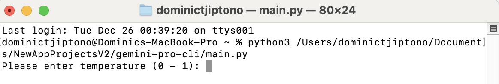
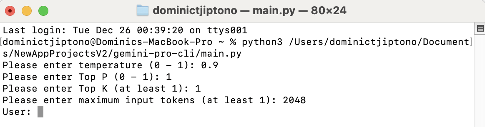
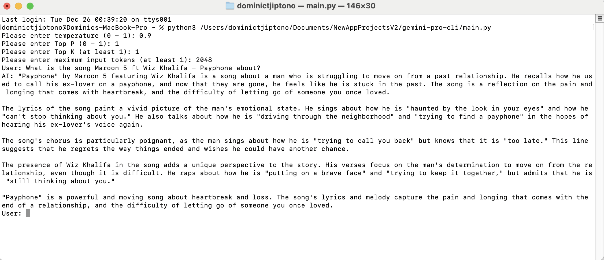

# gemini-pro-cli

This application allows users to use Gemini Pro on command-line interface (CLI).

# Source Code

The source code for the Gemini Pro CLI application is available in 
https://github.com/GlobalCreativeApkDev/gemini-pro-cli/blob/master/main.py.

# Installation

```
pip install gemini-pro-cli
```

# How to Use the Application?

Pre-requisites:
1. [Python](https://www.python.org/downloads/) installed in your device.
2. .env file in the same directory as <GEMINI_PRO_CLI_DIRECTORY> and has the value of GENAI_API_KEY.

First, open a Terminal or Command Prompt window and run the following command.

```
python3 <GEMINI_PRO_CLI_DIRECTORY>/main.py
```

**Note:** Replace <GEMINI_PRO_CLI_DIRECTORY> with the path to the directory of the application gemini-pro-cli.

Then, the application will start with something looking like in the screenshot below.



You will then be asked to input the following values.

1. Temperature - between 0 and 1 inclusive
2. Top P - between 0 and 1 inclusive
3. Top K - at least 1
4. Max output tokens - at least 1

The following screenshot shows what is displayed after inputting the mentioned values.



Next, you will have two choices:

1. Enter a non-empty prompt to receive a response from the AI.
2. Enter an empty prompt to exit the application.

Below is an example of what happens when you entered a non-empty prompt.

